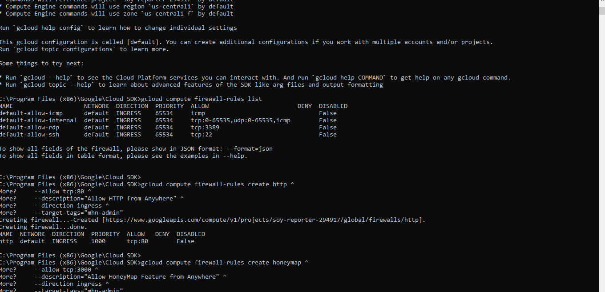
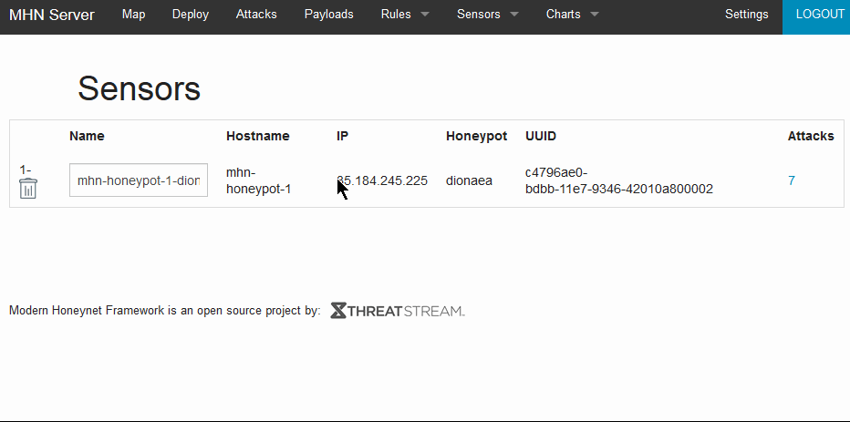

# Codepath-HoneyNet

**Time spent:** **7** hours spent in total

**Objective:** Create a honeynet using MHN-Admin. Present your findings as if you were requested to give a brief report of the current state of Internet security. Assume that your audience is a current employer who is questioning why the company should allocate anymore resources to the IT security team.

### MHN-Admin Deployment (Required)

**Summary:** Used GCP sdk w/mhn-admin virtual machine

### Dionaea Honeypot Deployment (Required)

**Summary:** Briefly in your own words, what does dionaea do?
It's a honeypot that acts as bait for cyber-attackers/criminals to make them attack they database and/or system.

### Database Backup (Required) 

**Summary:** What is the RDBMS that MHN-Admin uses? What information does the exported JSON file record?
MHN-Admin uses MongoDB, the exported JSON file record contains a list of records of every attack on the honeypot.
Ran for around half an hour at time of gif, ran for few hours after that before exporting json.

*Be sure to upload session.json directly to this GitHub repo/branch in order to get full credit.*

## Notes

Describe any challenges encountered while doing the assignment.

Had to install some new software(such as MongoDB) and learn to navigate new tools such as GCP which was the challenge :)
